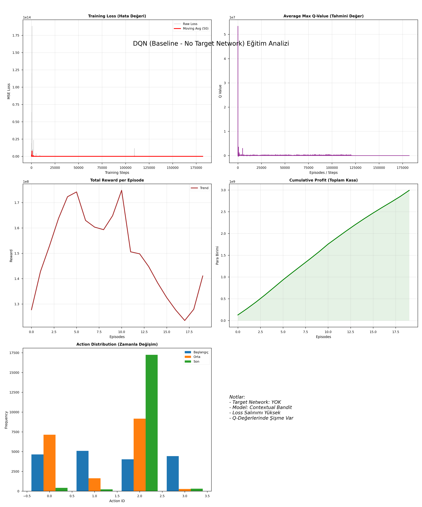

# AI-Driven Dynamic Insurance Pricing System: Survival Analysis & Deep Reinforcement Learning

## 📌 Overview
Traditional insurance pricing heavily relies on static, population-based actuarial tables, which fail to capture the complex, non-linear variability in individual health profiles and ignore the long-term impact of pricing on customer churn. 

This project introduces an end-to-end Artificial Intelligence framework to solve this problem. It bridges the gap between predictive clinical risk estimation and dynamic financial optimization by combining **Deep Survival Analysis (DeepSurv)** with a **Deep Reinforcement Learning (DQN)** agent. The agent dynamically adjusts premium multipliers to maximize cumulative profit while actively managing company reputation and customer retention.

## ⚙️ System Architecture & Data Flow

The architecture is designed as a sequential pipeline where clinical risk quantification is strictly decoupled from the stochastic optimization of the economic pricing policy.

<div align="center">
  
</div>

### 1. Risk Stratification Layer (Module 1: DeepSurv)
* **Data Source:** Vanderbilt BioStats dataset.
* **Model:** A Multi-Layer Perceptron (MLP) implementation of the non-linear Cox Proportional Hazards model.
* **Mechanism:** Uses the Negative Log-Partial Likelihood loss function to account for right-censored data points.
* **Output:** Generates a continuous `hazard_ratio`, quantifying individual risk relative to the population baseline.

### 2. Cost Prediction & Decision Support Layer (Module 2 & 3: GLM & DQN)
* **Cost Imputation:** Fits a Gamma Regression to predict base charges for incomplete records.
* **Environment (`InsuranceEnv`):** A custom OpenAI Gym simulation modeling stochastic customer purchasing behavior and claim occurrences.
* **Agent (`DQNAgent`):** Utilizes an augmented state vector (Patient Context + Risk Score + Base Charge + Dynamic Reputation) to output discrete premium multipliers (`0.8x, 1.0x, 1.2x, 1.5x`).

## 🧱 Object-Oriented Software Design

The codebase adheres to Object-Oriented Programming (OOP) principles, separating data preprocessing, risk modeling, and simulation environments into distinct, maintainable classes.

<div align="center">
  
</div>

---

## 📊 Key Results & Visualizations

### Stage 1: Survival Analysis Performance
The DeepSurv model successfully captured non-linear covariate interactions and converged smoothly, achieving a highly accurate **Concordance Index (C-Index) of 0.9815** on the test set.

<div align="center">
  
  
</div>

* **Feature Importance:** The model successfully discriminated between risk factors (e.g., specific comorbidities) and protective factors, aligning with clinical expectations.
<div align="center">
  
</div>

### Stage 2: Overcoming "Reputation Bankruptcy" with DQN
Baseline DRL models over-prioritized immediate high premiums, leading to a "Death Spiral" where the company's reputation collapsed to zero. By implementing a **Target Network** and shaping the environment's reward function, the final DQN agent successfully balanced short-term gains with long-term brand sustainability.

<div align="center">
  
  
</div>
*Left: Unstable baseline model causing reputation collapse. Right: Optimized DQN agent achieving sustainable cumulative profit while maintaining market reputation.*

---

## 💻 Tech Stack
* **Language:** Python 3.8+
* **Deep Learning:** PyTorch (Neural Networks, Tensor computations, AutoGrad)
* **RL Environment:** OpenAI Gym
* **Data Processing & Analytics:** Pandas, NumPy, Scikit-learn, Statsmodels

## 🚀 Execution Pipeline & How to Run

The system executes in a linear pipeline, processing raw clinical records into a trained dynamic pricing policy.

<div align="center">
  
</div>

### Installation
```bash
git clone [https://github.com/yourusername/AI-Dynamic-Insurance-Pricing.git](https://github.com/yourusername/AI-Dynamic-Insurance-Pricing.git)
cd AI-Dynamic-Insurance-Pricing
pip install -r requirements.txt
```

Running the Pipeline
Execute the modules sequentially from the root directory:

Clean Data: python src/preprocessing/DataCleaningEngine.py
Extract Risk Scores: python src/models/RiskModelingModule.py
Impute Charges: python src/preprocessing/ChargeImputing.py
Train DRL Agent: python src/rl_agent/DRLPricingAgent.py
